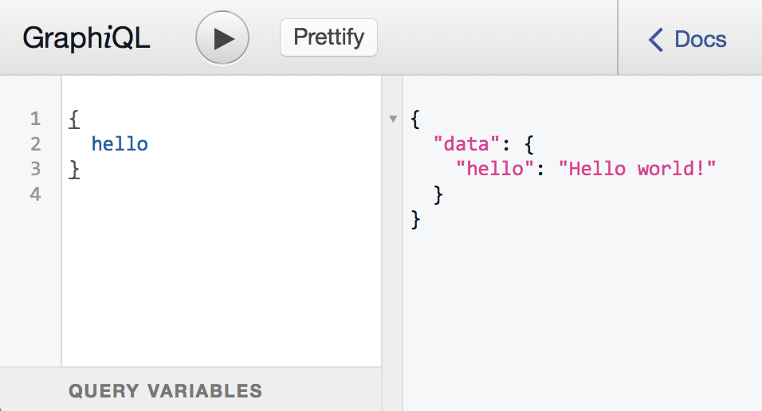

The simplest way to run a GraphQL API server is to use [Express](https://expressjs.com), a popular web application framework for Node.js. You will need to install two additional dependencies:

```bash
npm install express express-graphql graphql --save
```

Let's modify our “hello world” example so that it's an API server rather than a script that runs a single query. We can use the 'express' module to run a webserver, and instead of executing a query directly with the `graphql` function, we can use the `express-graphql` library to mount a GraphQL API server on the “/graphql” HTTP endpoint:

```js
var express = require('express');
var { graphqlHTTP } = require('express-graphql');
var { buildSchema } = require('graphql');

// Construct a schema, using GraphQL schema language
var schema = buildSchema(`
  type Query {
    hello: String
  }
`);

// The root provides a resolver function for each API endpoint
var root = {
  hello: () => {
    return 'Hello world!';
  },
};

var app = express();
app.use(
  '/graphql',
  graphqlHTTP({
    schema: schema,
    rootValue: root,
    graphiql: true,
  }),
);
app.listen(4000, () => {
  console.log('Running a GraphQL API server at localhost:4000/graphql');
});
```

You can run this GraphQL server with:

```bash
node server.js
```

Since we configured `graphqlHTTP` with `graphiql: true`, you can use the GraphiQL tool to manually issue GraphQL queries. If you navigate in a web browser to `http://localhost:4000/graphql`, you should see an interface that lets you enter queries. It should look like:



This screen shot shows the GraphQL query `{ hello }` being issued and giving a result of `{ data: { hello: 'Hello world!' } }`. GraphiQL is a great tool for debugging and inspecting a server, so we recommend running it whenever your application is in development mode.

At this point you have learned how to run a GraphQL server and how to use GraphiQL interface to issue queries. The next step is to learn how to [issue GraphQL queries from client code](./graphql-clients.md).
